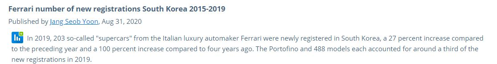
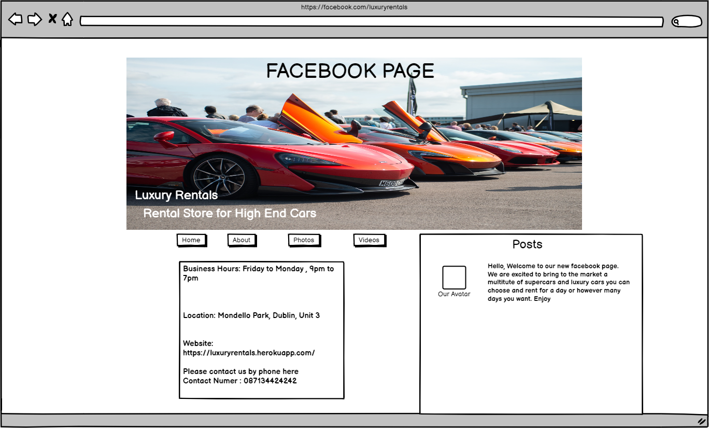
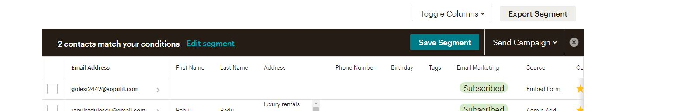
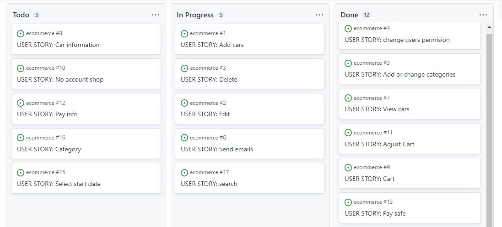
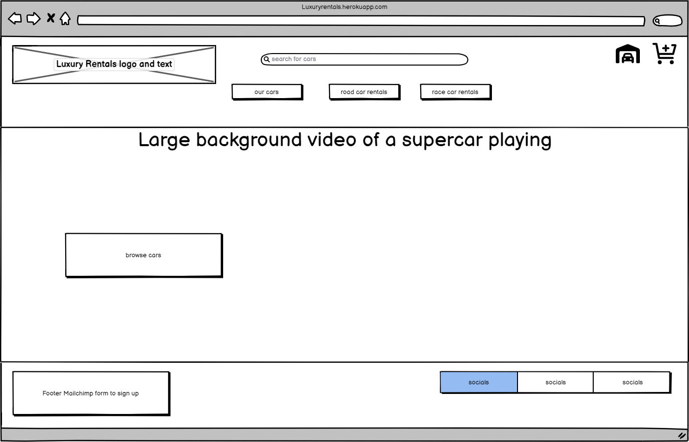
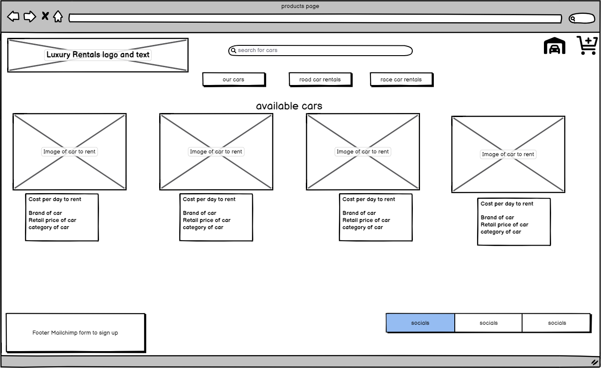
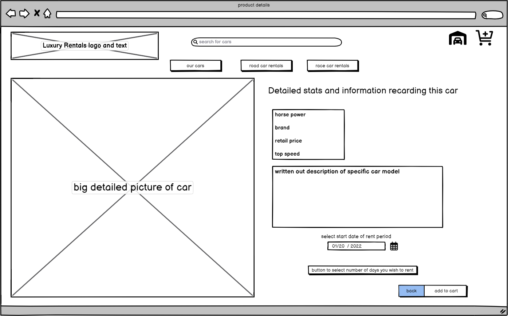
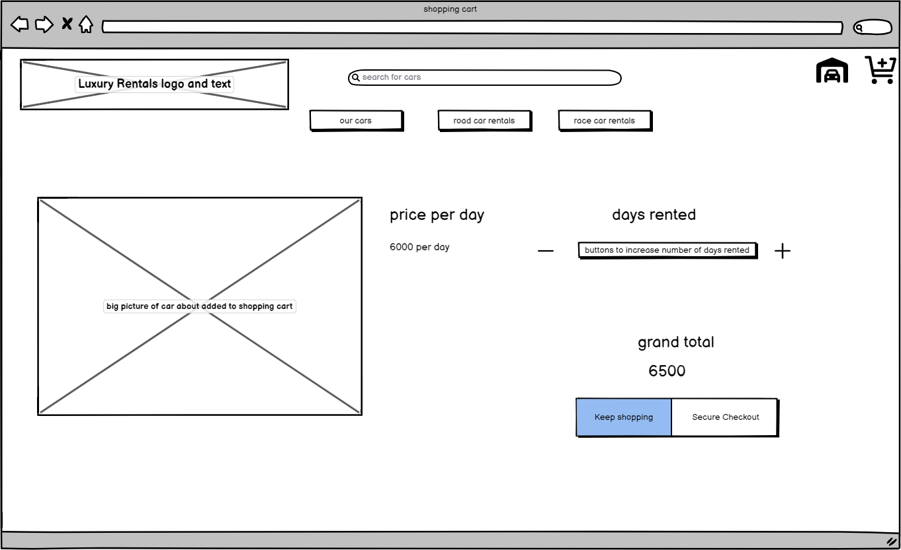
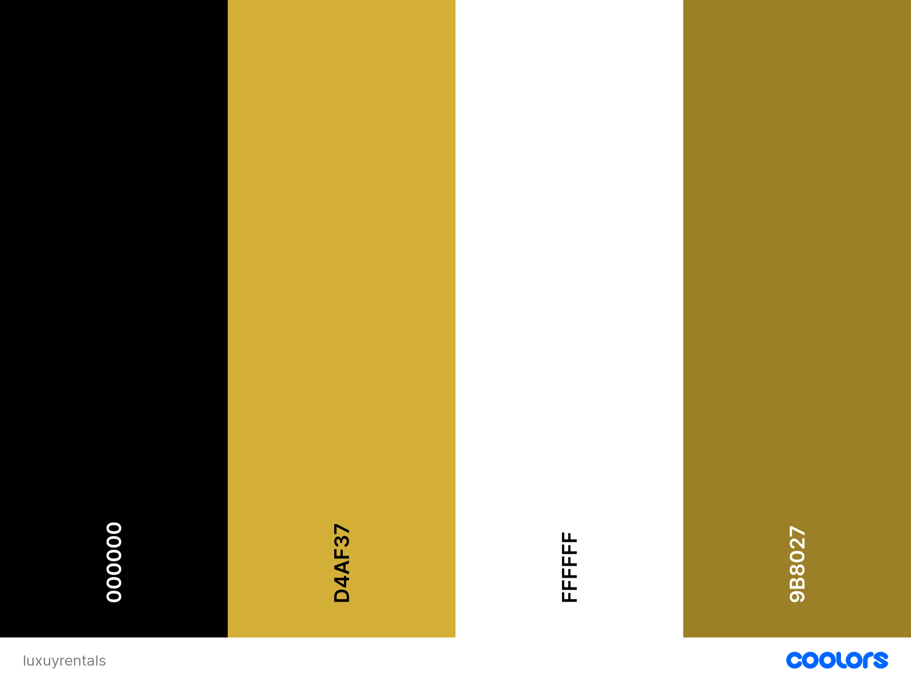

# Luxury Rentals

Luxury Rentals is an ecommerce web application aimed at people who enjoy high-end cars. This business is meant to give people an opportunity to rent expensive cars at a fraction of their cost. This way they can have life changing experiences without actually paying hundreds of thousands.

Users can browse a large inventory of supercars available on the website. They have access to a search bar to use when looking for a specific car or brand as well as multiple ways to sort through different categories. Every car has a couple of upfront details you can see right away but also more detailed information once you click on the entry.

The customer can also register with his email and create an account. 
While registered he can modify his profile to include personal billing details, which he can use to check out once hes ready to purchase a rental package. The payments are safely managed via Stripe.

Live link to [Luxury Rentals](https://luxuryrentals.herokuapp.com/)

## TABLE OF CONTENTS
* [Market Research](#market-research)
    - [Target Audience](#target-audience)
    - [Market Strategy](#market-strategy)
* [Agile](#agile)
* [User Experience](#user-experience)
    + [User Stories](#user-stories)
* [Design Scheme](#design_scheme)
    - [Wireframes](#wireframes)
    - [Colors](#colors)
    - [Fonts](#fonts)
    - [Images](#images)
* [Data Scheme](#data_scheme)
* [Features](#features)
    + [Header](#header)
    + [Footer](#footer)
    + [Home Page](#home-page)
    + [About Page](#about-page)    
    + [Sign Up Page](#sign-up-page)
    + [Log In Page](#log-in-page)
    + [Log Out Page](#log-out-page)        
    + [Post Detail Page](#post-detail-page)
    + [Post Item Page](#post-item-page)
    + [Delete Post Page](#delete-post-page)
    + [Admin Page](#admin-page)
    + [Features Not Implemented](#features-not-implemented)
* [SEO](#seo)
* [Stripe](#stripe)
* [Testing](#testing)
    + [Manual Testing](#manual-testing)
    + [Validator Testing](#validator-testing)
* [Deployment](#deployment)
* [Technology Used](#technology-used)
* [Credits](#credits)

# Market Research

Luxury Rentals is set up as a B2C (business to customer) model. This means that any person can use our website to rent a supercar, sportscar, racecar or luxurious limousine.

Nowadays everyone wants to be seen as rich or afluent by their peers and theres no better way to do that than driving an expensive car. 

That will be our main clientele.

Once the global situation happend a few years ago car prices have skyrocketed which has also trickled down into the high end rental market and the profits are high.

According to Statista.com , a stats website there has been a 100% increase in supercar purchases in the last few years, which indicates the money is there. 

## Target Audience

From the research I've done on sites like Google Analytics and Statista.com there are TWO types of people who "Luxury Rentals" will appeal to.

### Middle Class :

People who make decent income and sometimes treat themselves to a nice few days of driving a supercar or luxury car. 
    
This category also includes the ones who rent a supercar to show off online as from my research this is extremely common nowadays.

### Wealthy People :

People with lots of money who travel a lot and maybe cannot bring their personal cars with them. Luxury Rentals is here to fulfil their needs and have them travel in style.

## Market Strategy

### Our main Marketing Platform will be TikTok, since they are currently the most popular among young males and females. From our research their hashtag system and ability to show up in front of everyones eyes regardless of age or gender makes it an obvious choice. Tiktok is absolutely huge for high end cars right now.

We would pay or give discounts to influencers with large following and have them show our cars and websites in the background.

### Our secondary marketing platform is Facebook as it is still number one in terms of users and interraction worldwide. 

Luxury Rentals has a facebook page where you can contact us and keep in touch. This is vital nowadays since most young people do everything through facebook, not outside websites. 

Here is a mockup of the Facebook page made with Balsamiq.

## Mailchimp

We also use a sign-up form for our newsletter that lets users subscribe to us and receive promotional material, this is also very important to our marketing efforts. The email lists collected by this form are valuable in todays always online world so our admin can send the subscribed users small rewards and discounts.

# Agile

In order to complete this project I have used the Agile Methodology. This involves breaking down the project into smaller tasks called User Stories. These user stories were added using githubs Issues functionality. Each user story was made into an issue and added to the projects kanban board. 

I originally created my own user stories using an offline method but recently I've also uploaded them to github in the Projects section.

You can view my user stories in the kanban [board here.](https://github.com/users/RaoulRV/projects/3)

# User Experience

## Scope

In order to present the user with a compelling experience and have him enjoy his visit on our website, Luxury Rentals needs to tick a few boxes. The list below is an absolute must if we would like the user to return and recommend us to others.

Luxury Rentals needs to have these features: 

- Users can create and maintain their accounts using Django All-Auth registration and functionality.

- A landing page that makes it very apparent what the site is used for.

- A user profile page where users may view their order history and save billing information for quicker orders in the future.

- A Products Page that displays all of the Products found in the category or through the search.

- Products Cards that display an image of the item, its name, price, and an option to click for further information.

- A Search Bar, My Account Links, Shopping Cart Links, and Product Categories sections are included in the site navigation.

## User Stories

### Super-users

1. As a **superuser** I can **add cars** so that **I can have more cars available to rent**

2. As a **superuser** I can **edit a car entry** so that **I can change its price, details, description**

3. As a **superuser** I can change a normal users permisions so that I can stop a user from using my website if needed

4. As a **superuser** I can **send emails to customers** so that **I can more easily market my available stock of cars or send them news about our store**

5. As a **superuser** I can **add different categories of cars or change existing categories** so that **I am able to manage each entry properly**

6. As a **superuser** I can **delete a car entry** so that **I can manage my website properly and remove old cars when they break or aren't available**

### Users

7. As a **user** I can **use the recover password options** so that **to recover my password in case i forget**

8. As a **user** I can **receive a confirmation email when registering** so that **click the confirmation link be sure i am registered**
9. As a **user** I can **easily register for an account on the website** so that **receive benefits of a logged in user**
10. As a **user** I can search by using a simple searchbar so that i can find exactly the car im looking to rent
11. As a **user** I can sort cars by specific category easily so that i can choose which type of car i want
12. As a **user** I can **select the start date of a rental package** so that **i know when to go pick up my car**
13. As a **user** I can **see my order details** so that **i can verify the car i chose and the amount of days**
14. As a **user** I can **pay safely without having to worry about my details being stole** so that **i can shop with confidence**
15. As a **user** I can adjust the rental packages i saved in my cart so that i can remove cars or add more days to rent
16. As a **user** I can buy rental packages without being logged in ** so that ** I dont need to create an account before renting
17. As a **user** I can **easily view a list of cars ** so that **decide which one to rent**
18. As a **user** I can **click on a specific car ** so that see relevant information about its caracteristics
19. As a **user** I can sign up for the newsletter so that i can receive the latest updates
20. As a **user** I can **add payment info easily when checking out** so that **i dont have to spend much time before buying**
21. As a **user** I can **visit their facebook store page** so that **interact with the comunity closer**
22. As a **user** I can **add rental cars into my shopping cart ** so that **I can see how much i am spending and the total cost**

# Design Scheme
To make this project stand out among other vehicle rental companies, which tend to be dated, I wanted to develop a fresh, bright brand.

This was done with aid of a great "hero" video of a McLaren supercar which I will describe further in the "Features" section.

## Wireframes

### Homepage

### Cars View

### Car Details Page

### Shopping Cart

## Colors

I chose a straightforward and understated color scheme. Two different shades of gold were used, and there were also some black and white accents for buttons and backgrounds. This accentuates the luxurious feel of the site.

The flat, dark lighting of the hero video also draws attention to the colors.

I used COOLORS to generate this:

## Fonts

- I used a font named Space Grotesk because its modern and looks fast & cool so it fits with the theme of the supercar site. 

- You can find the font here [Space Grotesk](https://fonts.google.com/specimen/Space+Grotesk)

## Images

- Images were taken from "Romans International," a different luxury automobile store, and the quality was excellent. In addition, the setting complemented the subject of my website.

- The hero imagine isn't an image either its a video that loops of a supercar.

### Wireframes

## User Experience

The site was designed to be easy and intuitive to use.
A user for our site would have to be an adult that wishes to get rid of old items but he knows they still have value and doesn't want to throw them away. The user should also like to check whats already posted on the site by others, similar to a flea market.

### User Stories
- User Stories Implemented
    - View post list: As a Site User I can view a list of posts so that I can select one to read
    - Open a post: As a Site User I can click on a post so that I can check the item description
    - View likes: As a Site User / Admin I can view the number of likes - on each post so that I can see which is the most popular or viral
    - Account registration: As a Site User I can register an account so that I can post and like
    - Like / Unlike: As a Site User I can like or unlike a post so that I can interact with the content
    - Manage posts: As a Site Admin I can create, read, update and delete posts so that I can manage my sites content
    - Create drafts: As a Site Admin I can create draft posts so that I can finish writing the content later
    - View Address: As a Site User I can see the pick-up address on the main page without clicking on individual posts so that I don't waste any time
    - Pagination: As a Site User I can view a paginated list of items so that I can select which one I want to view
    - Phone Number: As a user I can click on each post and see the posters phone number so that I can contact them about the item
    - Big picture: As a user I can click on each post and see a bigger picture of the item so that I can check its condition
    - Post Item: As a user I can post an item on the website so that I can give it away
    - Delete a post: As a user I can delete a post I have made so that I can remove it when the item has been given away

- User Stories not yet implemented

    - Search Bar: As a user I can click on the searchbar and type the title of the post I'm looking for so that I can find what I'm interested in.

        - This was left out due to time constraints, however I will be adding this the next time I have some free time as its a core functionality of my site.

    - Comment on a post: As a Site User I can leave comments on a post so that I can be involved in the conversation

        - This wasn't implemented on purpose because I intended the website communication to be done via phone, that's why the phone number is provided by the poster.

    - Approve comments: As a Site Admin I can approve or disapprove comments so that I can filter out objectionable comments

        - Same reason as the "Comment on a post" story.

## Agile

In order to complete this project I have used the Agile Methodology.
This involves breaking down the project into smaller tasks called User Stories. These user stories were added using githubs Issues functionality.
Each user story was made into an issue and added to the projects kanban board. After each user story was coded into the websites functionality I would move the issue from "To Do" Column into "In Progress" and eventually into "Done" column depending what stage of development it was.

- You can see the live kanban board with all the user stories by [clicking here.](https://github.com/users/RaoulRV/projects/2/views/1)

## Data Model

I created a diagram in order to help me figure out how my model will look like. Once the diagram was completed I went ahead and created a custom model named Post.

## Testing

I have conducted thorough testing of the website, as well as some close friends who I have instructed to test the site.

I have also included these results separately [right here](https://github.com/RaoulRV/picknch/blob/main/static/testing.md)

## User Story testing

Issue No. | Title | Acceptance criteria | Testing carried out
----------|-------|---------------------|-------------------------
#01 | Manage posts | Admin can create, update or remove posts | Ensured that the admin user has full functionality of the create/delete/edit buttons by creating and deleting posts multiple times
#02 | Account registration | Easy registration process and login/logout process | Manually tested the registration form several times to ensure it works properly as well as logged in and logged out many times
#03|  Create post | The registered users can create posts pending approval from admin user | Ensure the creating, editing, viewing and deleting post is appropriately processed and that the procedures are straight forward. Restrict the editing and deleting post process to user's own entry only except for superusers
#04 | Create Drafts | Admin can create drafts that dont appear on the home page | Manually tested the draft dropdown menu and posted multiple drafts , also made sure they are not appearing outside of the django admin page.
#05 | Site pagination | User can select each item to view and change pages | Created multiple user profiles and multiple posts in order to check if everything works, also clicked the "Next" button to make sure it goes to next page
#06 | View Address | User can see posters address on main page | Made multiple posts and logged out to ensure I can still see the address for each post
#07 | View post list | All site visitor users can view the post list | Making sure every single post is visible on the home page to every user regardless if hes logged in or not, also making sure posts with draft status aren't visible. 
#08 | Open a post | Every user can open an individual post and view the contents inside but not interact with the post | Ensured the post details are available to everyone that clicks on the individual post, tested the link that opens post and it never failed, also made sure non-authenticated users cannot interact with the post at all
#09 | Phone Number | Every user can click on post details and see posters phone number | Created multiple user profiles and multiple posts where I added my number then logged out to make sure any non-authenticated or authenticated user can see the phone number
#10 | Big picture | A good sized picture of the item visible in post details | Manually added multiple posts and uploaded many different images to make sure they are properly displayed in the post details page, also checked if they are responsive
#11 | Delete a post | Authenticated user can delete his own posts but no one else's | Manually created multiple users and made a single post for each, then i logged in to different accounts to make sure a user can only delete his own post
#12 | Like/Unlike | Likes are visible to everyone but only registered users can interact with the button | Made sure I cannot use the like button while logged out, tested if it worked while i was logged in and checked to see if I can remove a like aswell as add a like to a post
#13 | View Likes | Likes properly saved and displayed on the homepage/post details | Liked and unliked manually on different user profiles and refreshed many times to see if they displayed properly on both pages
#14 | Searchbar | Not implemented | No tests
#15 | Comment | Not implemented | No tests
#16 | Approve Comments| Not implemented | No tests

## Manual Testing 

| Feature| Acceptance Criteria | Tests Carried out | Result |  
| --- | --- | --- | --- | 
| Admin CRUD | Admin account can create/update/delete posts | Created admin account, logged in and clicked every button for create,update or delete| Pass |
| Admin restricted access | Access to admin page is not available to normal users | Created a normal user and attempted to log into the admin page | Pass |
| Non Authenticated user/like  | Like button is visible but not activated/interactable | Logged out and refreshed the page to test if I can use the like button | Pass |  
| Non Authenticated user/create  | Post Item option is not visible if you're logged out|Logged out and refreshed the page many times, clicked on different pages of the website to check if Post Item is visible| Pass | 
| Registration/ left blank |A message appearing that says "fill out this field"| Attempted to create an account with fields left blank or adding a space and then clicking sign up| Pass | 
| Registration/ bad email| A message appearing that instructs you about email address format| Tried creating an account by using random letters and numbers, also by not finishing the address after "@"| Pass | 
| Registration/ Common Password |A message appearing that instructs you the password is too common| Added a password that was very simple and easy to guess such as "password"| Pass | 
| Registration/ Short Password |A message appearing that says your password is too short and it must contain 8 characters | Created account and added password "123"| Pass | 
| Login/ Blank Field | A message instructing you to fill out this field|Attempted to log in without filling up the username field | Pass | 
|Login/ Incorrect Username|A message that says "username or password you specified are not correct"|Tried logging in with random letters and numbers in the username field| Pass |
|Login/ Incorrect Password| A message that says "username or password you specified are not correct"|Tried logging in with random letters and numbers in the password field| Pass |
|Logged in/ like  | Like button is visible and active| Created a new user, logged in and clicked on the like button to see if I can interact with it| Pass | 
|Logged in/ Post Item  |Post Item button is visible in navigation bar|Created a new user and logged in, checked in the top left to see if Post Item was there, also clicked on it| Pass | 
|Post Item/ no image |The placeholder image should take its place| Created a new account and logged in, created a new post but didn't upload a picture and refreshed to check the homepage | Pass |
|Post Item/ Blank Fields |Not allowed to post if required fields are empty| Logged in and pressed on Post Item button, left every field empty and pressed on Post| Pass |
| Delete/ not author |Button should say "Delete not available"|Logged in on admin, created a post and then logged out and into another account. Checked the post I created previously and the delete button| Pass |
| Delete/ author |Delete button should be available and visible|Created a post on an account and then refreshed the homepage, clicked on the post and scrolled down to see the delete button| Pass | 
| Delete page|Page should pop up asking if you're sure you want to delete|Clicked on my own post, scrolled down and clicked the delete button| Pass |
|Message/ login | Message appears confirming successful login |Logged in on an account| Pass |
|Logout Page |Page pops up asking the user to confirm logout| Clicked on log out button| Pass |
|Message/ logout |Message appears confirming successful logout|Clicked on the log out button and then again on log out| Pass |
|Message/ Post Item|Message appears confirming your successful post| Clicked on post item and filled out the form, then clicked on post| Pass |
|Pagination|Next button appears on the bottom of the page and its clickable|Scrolled down and clicked on next button| Pass |
|Footer Socials|Social icons appear in the footer and open their pages in a new tab| Clicked on the social icons on the bottom of the page| Pass |

## Validator Testing

### CSS Validator
I ran the CSS code through W3C Validator and returned no errors:

### HTML Validator
I ran the entire website through HTML Validator as well and returned no errors:

### Pep8 Validator
I also ran all of the python code through Pep8 validator and returned no errors:

## Deployment To Heroku

I've used Heroku to host my website and in the following steps I will be describing how to deploy your project to Heroku as well;

- 1. Access https://www.heroku.com
- 2. Create an account and log in.
- 3. You will be directed to your dashboard once logged in.
- 4. Click on the button called "New" in the top right corner of the screen.
- 5. Click on Create new app from the drop down menu.
- 6. Choose an App Name and choose a region that's closest to your location, then click Create app.
- 7. Click on Settings and then click on "Config Vars"
- 8. After clicking on "Reveal Config Vars" please copy the following configuration:
    - CLOUDINARY_URL : < your cloudinary id goes here >
    - DATABASE_URL : < your postgres database key goes here>
    - SECRET_KEY = < the secret key you add her will need to be added in the settings.py file as well>
    - PORT : 8000
    - DISABLE_COLLECTSTATIC = 1 (remove this before final deployment)
- 9. In the "Buildpacks" field, click on the Add buildpack button.
- 10. Choose /herokupython and then save.
- 11. Click on the deploy tab at the top of the page.
- 12. In the deployment method choose github and then log in with your github account.
- 13. Choose which repository you want to deploy.
- 14. Scroll down and click the Deploy button.
- 15. Done!

## Technology Used

- HTML5
- CSS3
- Python
- Django
- Cloudinary
- Bootstrap
- FontAwesome
- Google Fonts
- GitPod
- GitHub
- DevTools
- Heroku
- Balsamiq
- PostgreSQL
- Allauth
- Summernote

## Credits
- Looka - Created custom logo
- Previous projects done by Code Institute students - Also a big source of inspiration
- Code Institute Tutor Team - They were a huge help and I couldn't complete this project without them.

### Header

### Footer

### Home Page

### About Page

### Sign Up Page

### Log In Page

### Log Out Page

### Post Detail Page

### Post Item Page

### Delete Post Page

### Admin Page

### Features Not Implemented