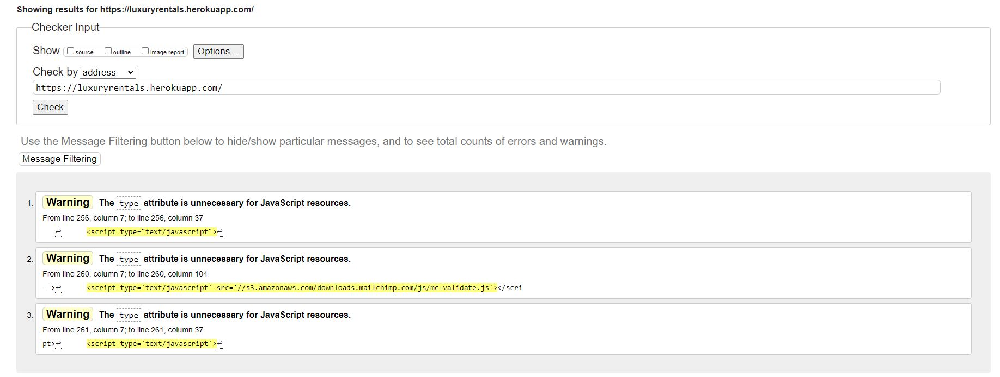

# Luxury Rentals

Luxury Rentals is an ecommerce web application aimed at people who enjoy high-end cars. This business is meant to give people an opportunity to rent expensive cars at a fraction of their cost. This way they can have life changing experiences without actually paying hundreds of thousands.

Users can browse a large inventory of supercars available on the website. They have access to a search bar to use when looking for a specific car or brand as well as multiple ways to sort through different categories. Every car has a couple of upfront details you can see right away but also more detailed information once you click on the entry.

The customer can also register with his email and create an account. 
While registered he can modify his profile to include personal billing details, which he can use to check out once hes ready to purchase a rental package. The payments are safely managed via Stripe.

Live link to [Luxury Rentals](https://luxuryrentals.herokuapp.com/)

## TABLE OF CONTENTS
* [Market Research](#market-research)
    - [Target Audience](#target-audience)
    - [Market Strategy](#market-strategy)
* [Agile](#agile)
* [User Experience](#user-experience)
    + [User Stories](#user-stories)
* [Design Scheme](#design_scheme)
    - [Wireframes](#wireframes)
    - [Colors](#colors)
    - [Fonts](#fonts)
    - [Images](#images)
* [Data Scheme](#data_scheme)
* [Features](#features)
    + [Header](#header)
    + [Footer](#footer)
    + [Hero](#hero)
    + [All Cars](#all-cars)
    + [Car Detail](#car-detail)     
    + [Sign Up Page](#sign-up-page)
    + [Log In Page](#log-in-page)
    + [Log Out Page](#log-out-page)  
    + [Product Management](product-management)      
    + [Admin Page](#admin-page)
* [SEO](#seo)
* [Stripe](#stripe)
* [Testing](#testing)
    + [Manual Testing](#manual-testing)
    + [Validator Testing](#validator-testing)
* [Deployment](#deployment)
* [Technology Used](#technology-used)
* [Credits](#credits)

# Market Research

Luxury Rentals is set up as a B2C (business to customer) model. This means that any person can use our website to rent a supercar, sportscar, racecar or luxurious limousine.

Nowadays everyone wants to be seen as rich or afluent by their peers and theres no better way to do that than driving an expensive car. 

That will be our main clientele.

Once the global situation happend a few years ago car prices have skyrocketed which has also trickled down into the high end rental market and the profits are high.

According to Statista.com , a stats website there has been a 100% increase in supercar purchases in the last few years, which indicates the money is there. 

## Target Audience

From the research I've done on sites like Google Analytics and Statista.com there are TWO types of people who "Luxury Rentals" will appeal to.

### Middle Class :

People who make decent income and sometimes treat themselves to a nice few days of driving a supercar or luxury car. 
    
This category also includes the ones who rent a supercar to show off online as from my research this is extremely common nowadays.

### Wealthy People :

People with lots of money who travel a lot and maybe cannot bring their personal cars with them. Luxury Rentals is here to fulfil their needs and have them travel in style.

## Market Strategy

### Our main Marketing Platform will be TikTok, since they are currently the most popular among young males and females. From our research their hashtag system and ability to show up in front of everyones eyes regardless of age or gender makes it an obvious choice. Tiktok is absolutely huge for high end cars right now.

We would pay or give discounts to influencers with large following and have them show our cars and websites in the background.

### Our secondary marketing platform is Facebook as it is still number one in terms of users and interraction worldwide. 

Luxury Rentals has a facebook page where you can contact us and keep in touch. This is vital nowadays since most young people do everything through facebook, not outside websites. 

Here is a mockup of the Facebook page made with Balsamiq.

## Mailchimp

We also use a sign-up form for our newsletter that lets users subscribe to us and receive promotional material, this is also very important to our marketing efforts. The email lists collected by this form are valuable in todays always online world so our admin can send the subscribed users small rewards and discounts.

# Agile

In order to complete this project I have used the Agile Methodology. This involves breaking down the project into smaller tasks called User Stories. These user stories were added using githubs Issues functionality. Each user story was made into an issue and added to the projects kanban board. 

I originally created my own user stories using an offline method but recently I've also uploaded them to github in the Projects section.

You can view my user stories in the kanban [board here.](https://github.com/users/RaoulRV/projects/3)

# User Experience

## Scope

In order to present the user with a compelling experience and have him enjoy his visit on our website, Luxury Rentals needs to tick a few boxes. The list below is an absolute must if we would like the user to return and recommend us to others.

Luxury Rentals needs to have these features: 

- Users can create and maintain their accounts using Django All-Auth registration and functionality.

- A landing page that makes it very apparent what the site is used for.

- A user profile page where users may view their order history and save billing information for quicker orders in the future.

- A Products Page that displays all of the Products found in the category or through the search.

- Products Cards that display an image of the item, its name, price, and an option to click for further information.

- A Search Bar, My Account Links, Shopping Cart Links, and Product Categories sections are included in the site navigation.

## User Stories

### Super-users

1. As a **superuser** I can **add cars** so that **I can have more cars available to rent**

2. As a **superuser** I can **edit a car entry** so that **I can change its price, details, description**

3. As a **superuser** I can change a normal users permisions so that I can stop a user from using my website if needed

4. As a **superuser** I can **send emails to customers** so that **I can more easily market my available stock of cars or send them news about our store**

5. As a **superuser** I can **add different categories of cars or change existing categories** so that **I am able to manage each entry properly**

6. As a **superuser** I can **delete a car entry** so that **I can manage my website properly and remove old cars when they break or aren't available**

### Users

7. As a **user** I can **use the recover password options** so that **to recover my password in case i forget**

8. As a **user** I can **receive a confirmation email when registering** so that **click the confirmation link be sure i am registered**
9. As a **user** I can **easily register for an account on the website** so that **receive benefits of a logged in user**
10. As a **user** I can search by using a simple searchbar so that i can find exactly the car im looking to rent
11. As a **user** I can sort cars by specific category easily so that i can choose which type of car i want
12. As a **user** I can **select the start date of a rental package** so that **i know when to go pick up my car**
13. As a **user** I can **see my order details** so that **i can verify the car i chose and the amount of days**
14. As a **user** I can **pay safely without having to worry about my details being stole** so that **i can shop with confidence**
15. As a **user** I can adjust the rental packages i saved in my cart so that i can remove cars or add more days to rent
16. As a **user** I can buy rental packages without being logged in ** so that ** I dont need to create an account before renting
17. As a **user** I can **easily view a list of cars ** so that **decide which one to rent**
18. As a **user** I can **click on a specific car ** so that see relevant information about its caracteristics
19. As a **user** I can sign up for the newsletter so that i can receive the latest updates
20. As a **user** I can **add payment info easily when checking out** so that **i dont have to spend much time before buying**
21. As a **user** I can **visit their facebook store page** so that **interact with the comunity closer**
22. As a **user** I can **add rental cars into my shopping cart ** so that **I can see how much i am spending and the total cost**

# Design Scheme
To make this project stand out among other vehicle rental companies, which tend to be dated, I wanted to develop a fresh, bright brand.

This was done with aid of a great "hero" video of a McLaren supercar which I will describe further in the "Features" section.

## Wireframes

### Homepage

### Cars View

### Car Details Page

### Shopping Cart

## Colors

I chose a straightforward and understated color scheme. Two different shades of gold were used, and there were also some black and white accents for buttons and backgrounds. This accentuates the luxurious feel of the site.

The flat, dark lighting of the hero video also draws attention to the colors.

I used COOLORS to generate this:

## Fonts

- I used a font named Space Grotesk because its modern and looks fast & cool so it fits with the theme of the supercar site. 

- You can find the font here [Space Grotesk](https://fonts.google.com/specimen/Space+Grotesk)

## Images

- Images were taken from "Romans International," a different luxury automobile store, and the quality was excellent. In addition, the setting complemented the subject of my website.

- The hero imagine isn't an image either its a video that loops of a supercar.

# Data Scheme

- Used DrawSQL to present my models

# Features

## Header

- I made a unique logo for the header using the Looka website; it was free and simple to use. You can see it in the top left
- The search bar is one of the first things a user notices and its nicely styled to fit with the rest of the website.
- There are 3 navigation buttons which have dropdown menus to select further categories.
- In the top right you can notice the "My Garage" icon which is like a profile for the user where he can see his previously rented cars.
- You can also see the shopping cart icon. 

## Footer

- On the left there is a mailchimp signup form which I have made transparent to fit in with the websites theme.
- I have links to Facebook, Twitter, Instagram, and Youtube in the footer section.
- When you hover over the icons, you get feedback and they are totally interactive.
- To avoid diverting the user, when an icon is clicked, the page will open in a new tab.

## Hero

- I named this the hero section because its the most striking aspect of the website.
- The video plays in the background muted and in a loop slowly moving around the supercar.
- There is a call to action for people who want to drive nice cars as well and a button for them to check out our inventory

## All Cars

- Here you can see all the cars in our inventory with some short details about them. 
## Car Detail

- In this section you can notice more detailed description of the car and more technical specifications.

- This view includes horsepower, msrp, top seed etc.

- You can also add to cart from this view after selecting how many days you want to rent and your starting date

## Sign Up Page

- In this page you can see the regular sign up form

- It has validation and stops you from using bad emails or bad passwords

## Log In Page

### Log Out Page

- Here are both the login and log out pages

## Product Management

- In this page you can add a new car into our fleet from the website, no need to go in admin page.
- Just fill up the correct fields in the form.

## Shopping Cart

## Order Success

- In this page , you are presented with a quick rundown of your order details that you have just placed.
## Checkout

- In the checkout view you can fill in your personal details and and press secure checkout to buy your rental package!

## My Garage

- In the "my garage" page you are presented with a form to store your personal details which youve used previously and  also an order history of cars that you have rented before !

## Various Toast Messages

- There are various messages that pop up accross the website whenever we complete an action or whenever it gives us a warning.
- These ones are mostly positive and there are a couple more messages that will pop up if you do something wrong.

## 404 Page

- This is our 404 page thats used to throw out errors whenever a user is attempting to access a page that doesn't work or hes not allowed to.

## Admin Page

- As you can see our admin page is well structured and organized.
- It allows us to do all the CRUD actions that we require and can really manage the whole store flawlessly.
- I can also change a users status or give them permisions.

# SEO

## sitemap.xml
- I generated a sitemap.xml file from XML-sitemaps and downloaded it.
- I then added it to my projects root file to help search engines identifying my site properly and navigate more easily.

## Tags

- I've made sure to add lots of descriptive keywords in meta tags ands aria labels in most of my code just to improve SEO.

## robots.txt 

- I also added a file called robots.txt that instructs the search engine where to look and where not to look in our site, this also improves SEO a lot.

# STRIPE

- On this project we implemented a service called Stripe to handle payments from our customers.
- Once you set up webhooks successfully you should be able to see payments succeed in your Stripe dashboard.
- If you would like to test purchase anything on my website you can use these card details:
    - Card number: 4242 4242 4242 4242
    - expiry: any date in the future
    - cvs: 42424

### As you can see my Stripe webhooks and payments have gone through successfully.

# Testing

I have conducted thorough testing of the website, as well as some close friends who I have instructed to test the site.

## Manual Testing

## User Story Testing

1. As a user I can use the recover password options so that to recover my password in case i forget

    - The 'Forgot Password' option at the bottom of the login page was used to test this. A link is then sent to the user through email, so I tested this with an already-sent email to be sure the link was received.

    - The user must wait for the password reset link to be received before using it. Once it does, they are directed to a website where they must input their old password twice in order to reset it. The user is led to a confirmation page with a bootstrap toast displaying a success message after entering the new password. An error notice alerts the user so they can try again if the passwords do not match.

2. As a user I can easily register for an account on the website so that receive benefits of a logged in user

    - This was tested by registering a couple of user accounts and:
        - making sure they worked by logging out and back in.
        - clicking the confirmation link in the email
        - scanning for verified email addresses in the admin panel.
        - using an already-existing email address to attempt to create an account

    - I also added an address to my profile and made an attempt to complete a checkout to test the information. The address saved in the profile was automatically filled up on the checkout page as a result. To further test this, I placed an order while making sure the user's profile address was saved and the box to save details to the profile was checked.

 3. As a user I can search by using a simple searchbar so that i can find exactly the car im looking to rent
    - I tested this by searching using the search bar in the header and also by searching through the category links
    - The number showed matched the number of searches on each page, and it can be found at the top left of the page along with the search keyword.

4. As a user I can sort cars by specific category easily so that i can choose which type of car i want

    - I went to the all car view and tested every single sorting option in the "sort by" section.
        - this included : Sort by name, sort by category and sort by price.
        - all of those options returned expected results

5. As a user I can select the start date of a rental package so that i know when to go pick up my car

    - I clicked on the a car entry and was taken to the car details page.
    - There i was able to select the Start Date and the Amount of Days i would like to rent with no issues.

6. As a user I can see my order details so that i can verify the car i chose and the amount of days
    - I selected a car to check out, I put in the number of days and the date and clicked check out.
    - After inputting my details , i clicked on secure checkout and was presented with my order details
    - I tried multiple times with various values trying to trick the form but it worked every time

7. As a user I can pay safely without having to worry about my details being stole so that i can shop with confidence
    - If the user has an account, address details can be saved and updated/removed as needed. By adding and deleting addresses from the profile page, this was put to the test. In order to verify that the address was saved on the User's Profile page after checkout, it was also inserted and saved to the profile.

    - The project makes use of Stripe to handle payments, protecting customer payment information and preventing it from being saved in their user profile.

8. As a user I can adjust the rental packages i saved in my cart so that i can remove cars or add more days to rent
    - I added a car to my cart and then went to the shopping cart page
    - Once on the page i was presented with the correct information as expected
    - Once I tried adjusting the packages that i added to my cart , the update went through without any issue
    - I tried multiple times to trick the system by refreshing the page etc.

9. As a user I can buy rental packages without being logged in  so that I dont need to create an account before renting
    - Without being logged into an account, an order was placed. To make sure it matched what was put in the bag and afterwards checked out, it was tested by comparing the order confirmation, email confirmation, and the order within the order model. 

10. As a user I can easily view a list of cars ** so that **decide which one to rent
    - Once I clicked on the browse cars button I was presented with a well ordered list of cars with the right dimensions.
    - The cars are displayed using bootstrap cards and are very responsive due to their classes, which means the layout of the cards changes with screen size.
    - All images are displayed unless theres no image, at which point the site will display a default image pre-set in the code.

11. As a user I can click on a specific car  so that see relevant information about its caracteristics
    - I clicked on a card with the picture of a car, it took me to the car details page
    - On the page it shows specific details related to that car in particular
    - These details included horse power, speed, msrp etc.
    - I checked different cars to see if any description is the same and all of them were different

12. As a user I can sign up for the newsletter so that i can receive the latest updates
    - The user can subscribe by providing their email and clicking submit in the footer. An error warning shows below the email box if there is a problem with the email. If successful, a success message is displayed instead.

    - By subscribing with a test email and logging into Mailchimp to view the contacts, the subscription was tested. After making sure the contact was present, I scanned the page to check if they had subscribed.

13. As a user I can add payment info easily when checking out so that i dont have to spend much time before buying
    - Submitted an order while simply filling out the checkout form's mandatory information. Both Stripe and the Database successfully processed the order, which was also recorded with a success Webhook message.

    - Attempted to place an order using the wrong card information. The wrong details are confirmed by an error message that displays beneath the card details form.

    - Tried to place an order with a card that has expired. The card has expired, according to an error message that displays beneath the card details form.

    - Attempting to send a purchase order with a missing order form. All blank necessary fields notify the user that they must be filled out in order for the form to be finished and submitted.

14. As a user I can visit their facebook store page so that interact with the comunity closer
    - I scrolled down to the footer where the facebook icon is located
    - Click on the Icon and was taken directly to their facebook page
    - It opened in a new window as expected and didnt close the previous one

15. As a user I can add rental cars into my shopping cart  so that I can see how much i am spending and the total cost
    - I verified to make sure the right product was added before adding an item to the cart.

    - In order to make sure the quantity in the cart matched what was added, I raised the quantity before adding it.

    - When I tried to add 0 or a quantity greater than 99, the quantity box displayed an error notice informing me that the quantity could only be between 1 and 99. The buttons are deactivated if the user attempts to decrease to 0 or increment above 99 when using them instead of inputting the quantity. I was unable to add a quantity because it exceeded the permitted quantity limit.

16. As a user I can receive a confirmation email when registering so that click the confirmation link be sure i am registered
    - By sending an order to an email address that can be verified, email confirmation was tried. The right order data and a contact email were included in an email confirmation that was sent in accordance with the template set up in the checkout app.

17. As a superuser I can add cars so that I can have more cars available to rent
    - Both the Admin Panel and the project management page, which can be accessed by clicking on "My Account," can be used to add CARS. Both methods of adding cars were evaluated, and the cars that were tested could be seen both in the models as well as in the page.

18. As a superuser I can edit a car entry so that I can change its price, details, description
    - You can edit an entry in two ways, one using the admin panel and another using the edit button which appears if youre logged in as superuser.
    - I checked if that edit button appeared otherwise and it didnt if youre not a superuser.
    - Clicked the edit button and was able to edit every single field , price description etc
    - Also checked the admin panel for editing and it was the same situation everything worked without issue

19. As a superuser I can change a normal users permisions so that I can stop a user from using my website if needed
    - That can be done from the admin panel by clicking on their email and selecting the remove option.
    - This was indeed possible if you are logged into the admin panel and the user was deleted from the database.

20. As a superuser I can send emails to customers so that **I can more easily market my available stock of cars or send them news about our store
    - When a customer signs up for emails, their information is added to the company's Mailchimp contacts list, where they can later be removed.

    - This was checked by sending an email to subscribe and then verifying that it was received by checking the Mailchimp email list. In order to make sure it was simple to remove an email from the email list, I also looked at the unsubscribe functionality.

21. As a superuser I can add different categories of cars or change existing categories** so that I am able to manage each entry properly
    - I tested this by logging into the admin panel and clicking on the categories section and then click on the plus button.
    - I could indeed add a category if i provided its name and its friendly name
    - I tried adding an existing category and it wouldnt let me

22. As a superuser I can delete a car entry so that I can manage my website properly and remove old cars when they break or aren't available**
    - I tested this by clicking delete on a car entry, once i clicked i was taken to a delete confirmation page
    - If you confirm delete , it removes the car from the database and its no longer available in the "all cars" view
    - I tested to see if you could return to that old product but , i was greeted with a 404 error page.

## Site Features Testing
 

| Feature| Acceptance Criteria | Tests Carried out | Result |  
| --- | --- | --- | --- | 
| Admin CRUD | Admin account can create/update/delete any car entry | Created admin account, logged in and clicked every button for create,update or delete| Pass |
| Admin restricted access | Access to admin page is not available to normal users | Created a normal user and attempted to log into the admin page | Pass |
| Non Authenticated check profile/ garage  | My garage option isn't visible | Logged out and refreshed the page to test if I can still go into my garage | Pass |  
| Non Authenticated admin user/ product management  | Product management is not available if logged out|Logged out and refreshed the page many times, clicked on different pages of the website to check if the product management page was visible| Pass | 
| Registration/ left blank |A message appearing that says "fill out this field"| Attempted to create an account with fields left blank or adding a space and then clicking sign up| Pass | 
| Registration/ bad email| A message appearing that instructs you about email address format| Tried creating an account by using random letters and numbers, also by not finishing the address after "@"| Pass | 
| Registration/ Common Password |A message appearing that instructs you the password is too common| Added a password that was very simple and easy to guess such as "password"| Pass | 
| Registration/ Short Password |A message appearing that says your password is too short and it must contain 8 characters | Created account and added password "123"| Pass | 
| Login/ Blank Field | A message instructing you to fill out this field|Attempted to log in without filling up the username field | Pass | 
|Login/ Incorrect Username|A message that says "username or password you specified are not correct"|Tried logging in with random letters and numbers in the username field| Pass |
|Login/ Incorrect Password| A message that says "username or password you specified are not correct"|Tried logging in with random letters and numbers in the password field| Pass |
|Logged in/ save details  | The save details tickbox is available and works | Created a new user, logged in and clicked on the checkbox after inputting my details | Pass | 
|Logged in/ billing details saved  |billing details saved from previous purchases |Created a new user and logged in, made a purchase and saved the details, added another car to my cart and when i checked out, details were saved| Pass | 
|Post Car Entry/ no image |The placeholder image should take its place| Created a new account and logged in, created a new post but didn't upload a picture and refreshed to check the homepage | Pass |
|Post Car Entry/ Blank Fields |Not allowed to post if required fields are empty| Logged in as admin and left every field empty and pressed on submit | Pass |
| Delete car entry/ not admin |Button shouldn't be visible |Logged in on admin, noticed the delete button is visible then logged into a normal user but the button wasnt visible| Pass |
| Subscribe mailchimp |Submit button should work after you add ur email|Added email in the footer form and clicked submit, also added a bad email and got an error | Pass | 
| Delete car entry page|Page should pop up asking if you're sure you want to delete|Clicked on a car entry, was taken to details page and clicked on delete, it took me to a new page| Pass |
|Message/ login | Message appears confirming successful login |Logged in on an account| Pass |
|Logout Page |Page pops up asking the user to confirm logout| Clicked on log out button| Pass |
|Message/ logout |Message appears confirming successful logout|Clicked on the log out button and then again on log out| Pass |
|Message/ Admin Post Product|Message appears confirming your successful post| Product management > filled out the form and pressed submit, message appeared | Pass |
|Search bar |Searchbar should return a car related to your search|Searched for the word ferrari and it returned ferrari cars| Pass |
|Category dropdown menu|A menu should drop down revealing the sort options | Clicked on the drop down and the sort by options were revelead | Pass |
|Secure Checkout |Adding bad credit card information should return an error| Added 0000 in all fields and the error message appeared| Pass |
|Forgot Password |Clicking on forgot password in the login should take you to a password reset page|Clicked on forgot password and it took me to a password reset page| Pass |
|Admin / Edit |The edit option should be visible if youre an admin|Logged in as an admin and the option is visible and clickable| Pass |
|Footer Socials|Social icons appear in the footer and open their pages in a new tab| Clicked on the social icons on the bottom of the page| Pass |

## Validator Testing

### CSS Validator
I ran the CSS code through W3C Validator and returned no errors:

### HTML Validator
I ran the entire website through HTML Validator as well and returned no errors:

###
I also used Lighthouse on most pages and they were all good scores, Accesibility is barely not in the green because of stylistic choices

### Pep8 Validator
#### I used the "black" feature to check python code in most pages and it returned no error.

# Deployment

## 1. Get the project running locally with Django

- Go to Code Institutes Github

- On the Code Institute's "Full template", click on the "Use this Template" button.

- Open Gitpod from the template and inside Gitpod take the following steps:
- Install Gunicorn with pip3 "install Gunicorn" and also install django 
- Next you need to install the database libraries with : pip3 install dj_database_url psycopg2
- Time to create your Django project, in the terminal window type: django-admin startproject your-chosen-name
- Next start your Django app with : python3 manage.py startapp your_app_name
- Add your app to the settings.py file
- You should be good to go with django now, just type: python3 manage.py runserver

## 2. Implement Heroku and AWS

- Create a Heroku account if you dont have one

- Create a new app on heroku by clicking top right "Create new app"

- Go through the steps and select your region

- Click on the Settings tab of your new heroku tab

- Reveal Config vars and add the following configs: 

SECRET_KEY

AWS_ACCESS_KEY_ID

AWS_SECRET_ACCESS_KEY

EMAIL_HOST_PASS

EMAIL_HOST_USER

STRIPE_PUBLIC_KEY

STRIPE_SECRET_KEY

STRIPE_WH_SECRET

DISABLE_COLLECTSTATIC = 1

- Now go down to the Buildpack section click Add Buildpack then select python and Save Changes

- Click on the Deploy tab lower down the page

- Select Github when prompted

- Confirm you want to connect to GitHub and search for the repository then click the connect button

- Make sure you click on Enable Automatic Deploys so heroku deploys whenever you git push

- Create a Procfile "web: gunicorn your_project_name.wsgi"
- When you've finished coding your website make sure you change the DEBUG to False in settings.py
- Go back to heroku and take the following steps:
    - settings > config vars delete the record for DISABLE_COLLECTSTATIC

    - settings > config vars set the record for USE_AWS to True

## Technology Used

- HTML5
- CSS3
- Python
- Django
- Bootstrap
- FontAwesome
- Google Fonts
- GitPod
- GitHub
- DevTools
- Heroku
- Balsamiq
- PostgreSQL
- Allauth
- Jquery
- AWS
- Stripe

## Credits
- Romans International for the pictures of cars
- Pexels for the background video
- Boutique-ado walk through for the template
- Looka - Created custom logo
- Previous projects done by Code Institute students - Also a big source of inspiration
- Code Institute Tutor Team - They were a huge help and I couldn't complete this project without them.
- Also big thanks to Kasia for always being helpful
